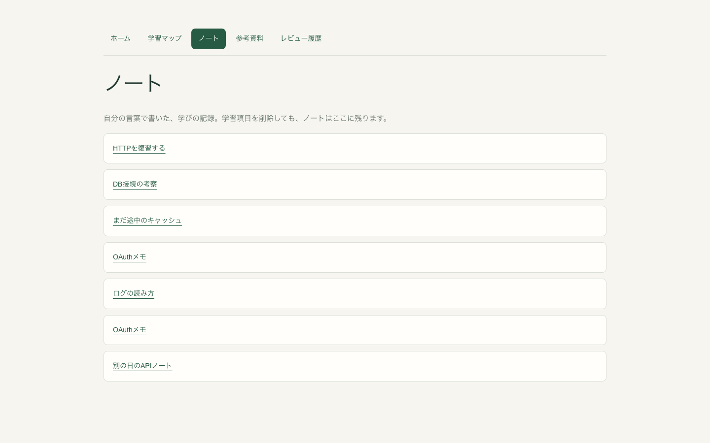
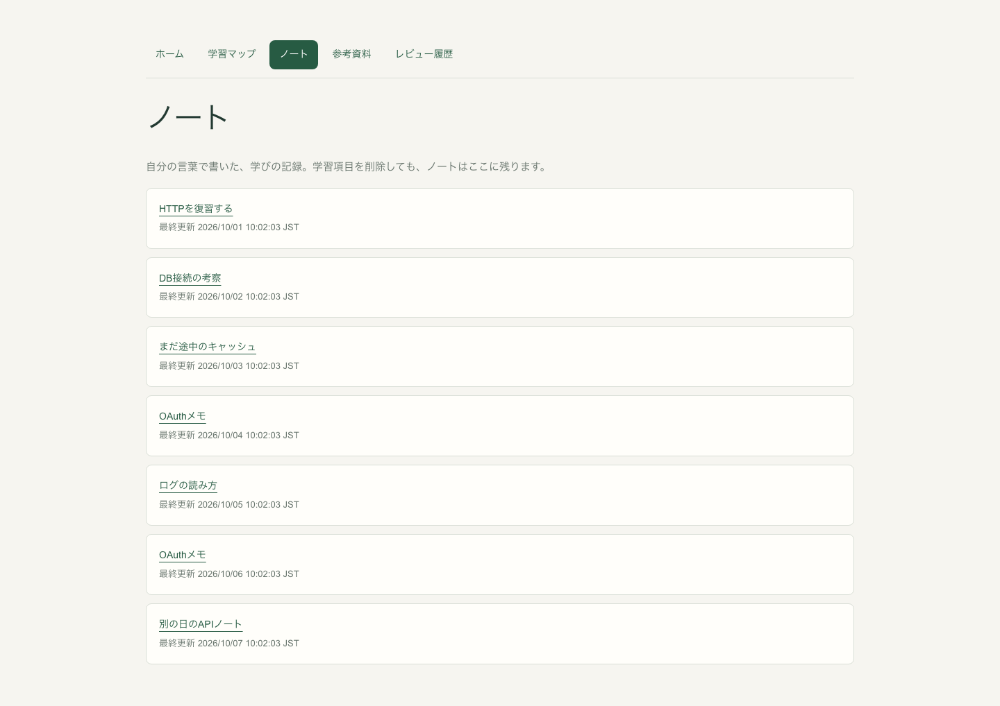
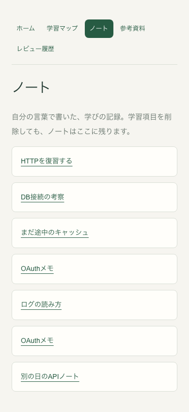
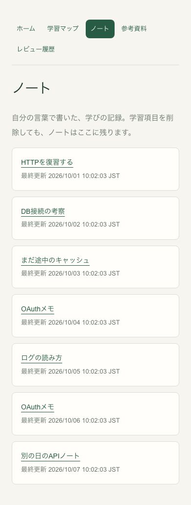
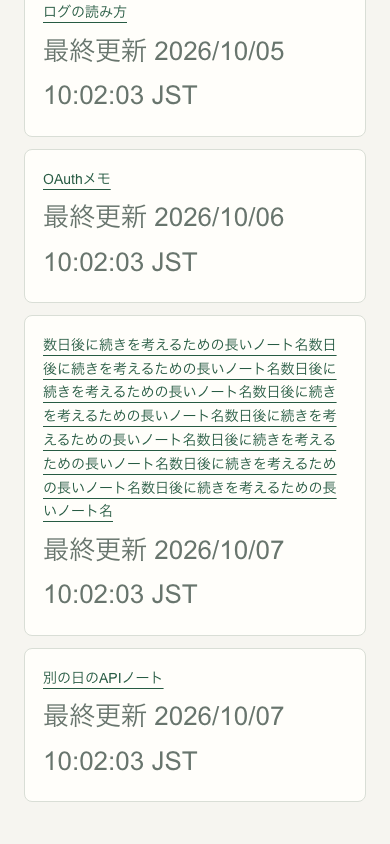

# ノート一覧の最終更新日時

Issue #136。本人が承認した「一覧のタイトル下に最終更新日時を小さく添える」方向を実装したDraftです。最終画像を親へ報告し、技術レビューとマージ判断へ進むための資料です。現時点ではマージしていません。

変更前は main `057f14f212c4e3b6e3b04fb67873dbd71ca62471`、実装コードは `b53ec2141e7cbbb487058bf29f4ed53f0b8e32b0`。製品変更は一覧の2ファイルだけです。並び順、API、編集画面、保存・Undoを変更していません。

## 日時の意味

[Document Service](../../modules/document/service.ts) の既存 `updatedAt` をそのまま表示します。作成時、本文・名前の保存、引用追加、ノートと学習項目の関連保存でDBへ記録された更新日時です。明示的に同じ内容を保存したPUTでも更新されるため、本文の変更日時やRevision作成日時と同義ではありません。表示名は「最終更新」です。

GET・閲覧・未保存入力でこの値は更新されません。保存前に競合で拒否されたPUTでも維持されます。応答が失われた場合は実際のDBコミットによるため、一覧日時だけで直前の保存結果を確定する用途にはしません。既存の保存結果確認手順はそのままです。

日本語表記・ブラウザーのタイムゾーンで、秒とタイムゾーンを表示します。`time` 要素の `dateTime` はAPIのISO値を保持。隣接する日時を `aria-describedby` でリンクへ関連付け、タイトルの読み上げ説明に加えます。新しいTab停止位置はありません。

## 変更前後

1440×900 / 390×844 のHeadless Chromium、専用隔離DB、前後で別の専用Workspaceに同じ7タイトル・固定日時を用意しました。全ページ画像です。表示検証は日本語・Asia/Tokyo（APIはUTC）です。実ユーザーデータや実時間経過の記録ではありません。

| 幅 | 変更前 | 変更後 |
| --- | --- | --- |
| 1440px |  |  |
| 390px |  |  |

日時はタイトル直下の13px・既存の控えめな色で、通常の390px幅でも1行。同名の「OAuthメモ」は10月4日と6日の更新日時で区別できます。小さい文字はrem指定で拡大可能です。

## 検証

- 変更前の画像取得2件、追加したブラウザー検証3件が成功。1440/390、長い名前、日時文字の13→26px拡大、APIの原日時、日本語・JST変換、異なる読み上げ説明、Tabで次のタイトルへ進む動線を確認。横にはみ出しなし。[実測JSON](assets/document-updated-ui/measurements.json)
- 閲覧と未保存の本文・名前で日時・保存内容・名前を維持（UI本文PUT0）。同一エディターとUndo/Redoも保持。本文と名前の保存成功後は一覧を再取得してAPI日時を表示。名前だけの保存は本文・Revisionを維持。競合で拒否された実PUT409は日時・本文・名前を維持。
- 未保存入力の検証のみ既存manual-note-fixtureで自動保存間隔を延長。日時を固定するSQLとWorkspace作成は専用E2E DBの所有fixtureだけに限定し、通常のAPIによる読み書きを確認しました。
- `npm run check` 成功：lint・型検査・ビルド、単体272件・結合64件・ブラウザー269件。`git diff --check` 成功。初回lintのテストfixtureの空引数パターンは修正済みです。

読み上げ説明はブラウザーのアクセシビリティ情報で検証しました。実OS支援技術、ネイティブIME、実AIは未検証。元45ファイル、既存DB、OS権限、tasteprint PR #135を変更していません。
