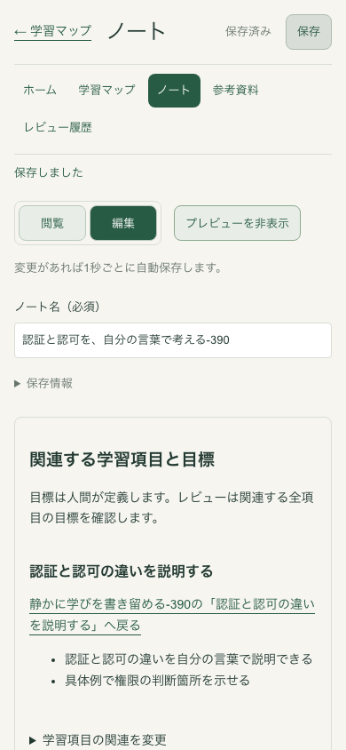
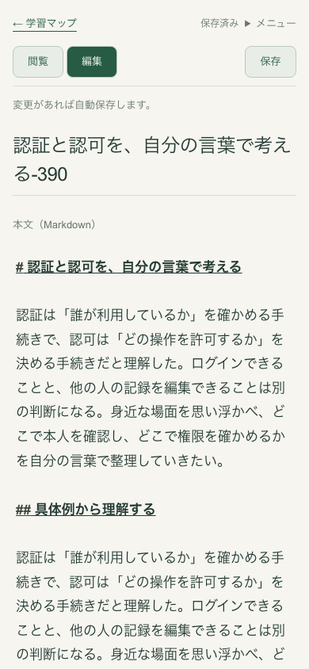
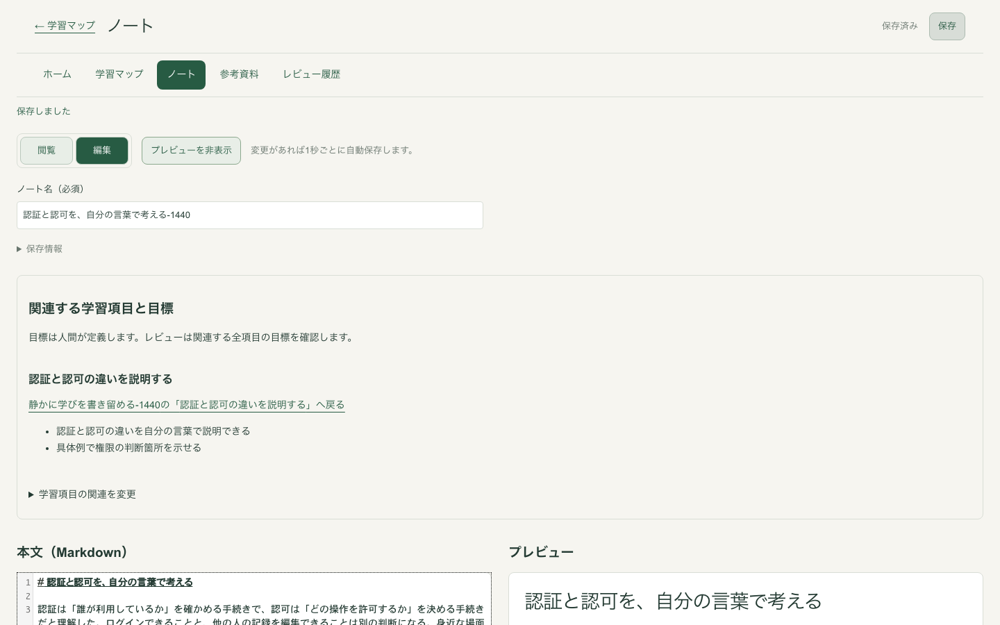
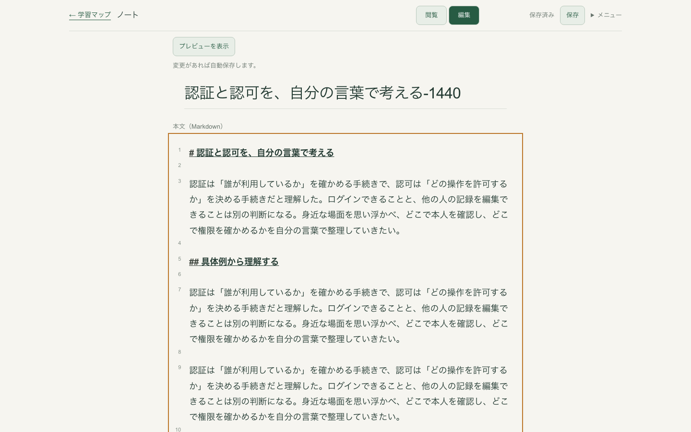

# ノート執筆画面の確認

本文中心の1カラム、淡い背景、17〜18pxの文字と1.8の行間を採用した。
タイトルと本文を先に表示し、目標・関連、資料、レビューは本文の下で開閉する。
閉じたパネルもマウントを維持し、入力、確認中の操作、離脱ガードを保持する。
保存状態と閲覧・編集の操作は固定ヘッダーから使える。

## 実画面での比較

Mock、専用DB、一時Markdown保存先を使用。マップ、項目、2つの人間定義の目標、ノートをUIから作成し、2,116文字をキーボードで入力した。
比較前はmain `aaf324e`。比較後は同じ製品コードの専用ブランチで撮影した。
寸法はこの入力例での実測であり、あらゆるタイトル・画面設定での固定値ではない。

| 幅 | 本文入力領域の上端（前 → 後） | 本文の文字／行高 | 長文入力時の保存表示の上端 |
| --- | --- | --- | --- |
| 390px | 約946 → 307px | 17／30.6px | 10px、画面内 |
| 768px | 後：約239px | 18／32.4px | 12px、画面内 |
| 1440px | 約825 → 287px | 18／32.4px | 12px、画面内 |

| 390px・前 | 390px・後 |
| --- | --- |
|  |  |

| 1440px・前 | 1440px・後 |
| --- | --- |
|  |  |

[768px](assets/note-writing/after-768.png)、[長文・390px](assets/note-writing/long-writing-390.png)、[長文・1440px](assets/note-writing/long-writing-1440.png)、[200%文字拡大](assets/note-writing/text-200-percent.png)。

## 保存と入力の受け入れ条件

- 確定、未保存、保存中、停止、結果不明、再開待ちを区別する。停止中に自動保存を約束する説明を出さない。
- 現在の入力と応答が一致するまで保存済みにしない。結果不明のまま古い本文へ戻しても結果不明を維持する。
- 最新GETは直前の書き込み成功の証明ではない。基準確認は書き込みゼロで、自動保存も再開しない。明示的な再試行を必要とする。
- 遅れて届く応答が後から書いた本文・名前を置き換えない。既存のbaseHash／baseWriteIdによる保護を維持する。
- 閲覧・編集の切り替えで同じCodeMirror DOM、選択、Undo履歴、編集位置を保持する。タイトルのEnterで本文へ移り、Cmd/Ctrl+Sは既存の安全な保存処理を呼ぶ。
- 引用後のUndo／Redo、出典情報、貼り付け規則、IME確定前の保存停止を維持する。
- 閉じた関連・資料パネルの未確定入力を再表示でき、移動を取り消すと入力が残る。パネルを閉じるだけでは書き込まない。
- 本文・目標は人間が書く。AIは固定Revisionをレビューし、本文生成や置き換えを行わない。

状態別画像：[保存中](assets/note-writing/pending-390.png)、[停止](assets/note-writing/stopped-390.png)、[結果不明](assets/note-writing/unknown-390.png)、[再開待ち](assets/note-writing/resume-wait-390.png)。実測値は[measurements.json](assets/note-writing/measurements.json)。

## 検証と限界

`npm run check`でlint、typecheck、unit 244件、integration 60件、browser 239件が成功。
追加した200%文字拡大も成功し、最終の執筆UXテスト5件を再実行して成功した。
既存テストは新しいメニュー・パネルを明示的に開く操作へ対応させ、競合、引用、レビュー通信、関連・資料の入力保護を引き続き検証する。

ブラウザー時計と応答保持を使って保存状態を検証している。IMEは合成compositionイベントでの契約確認であり、Macの実際の日本語候補選択は未確認。
200% CSS文字拡大と640pxのreflowを検証したが、OS／ブラウザーのネイティブズーム操作そのものは未確認。
長文のレビューはMock LOGICで確認した。既存FULLレビューの主張20件以内という制限は変更していない。
本文・タイトルの端末永続draftは追加しておらず、再読み込みやクラッシュ後の復元は保証しない。

マージ前に人間が実際に長く書き、文字組み、固定操作、フォーカスの見え方、日本語IMEを確認する。
