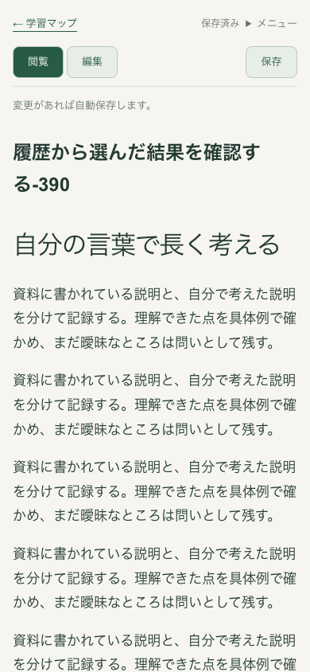
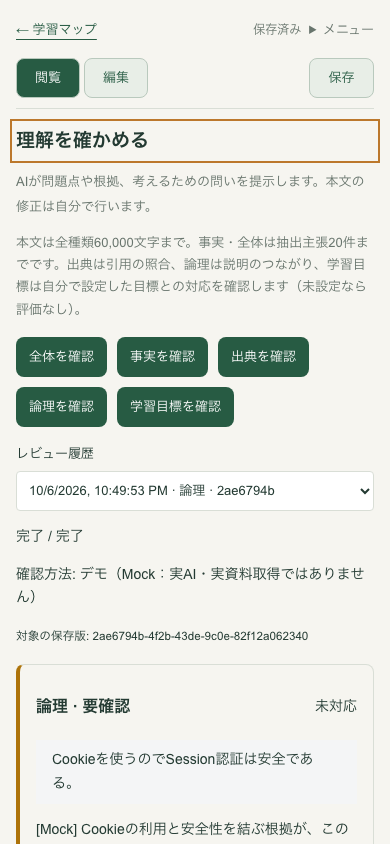
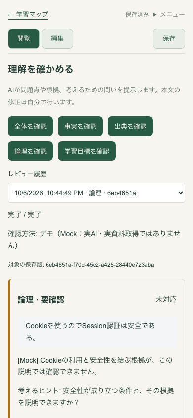
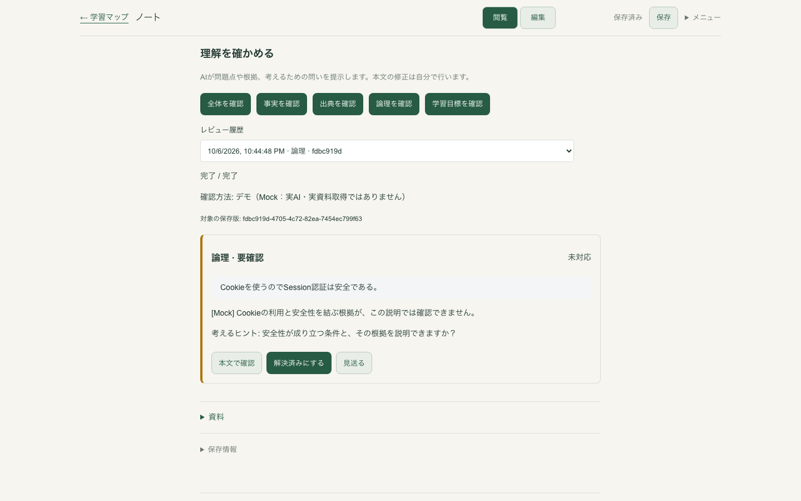
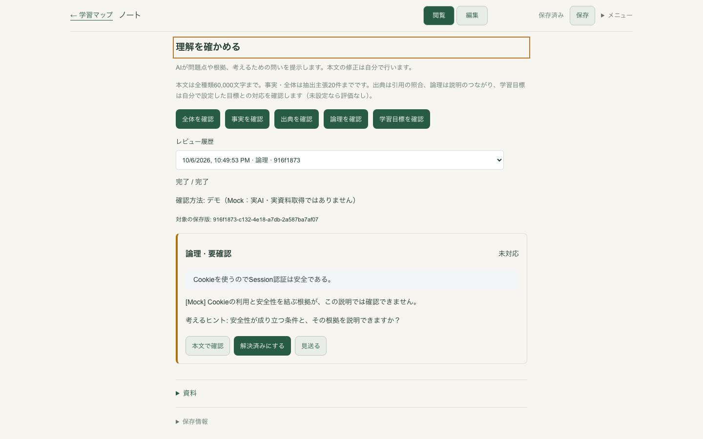

# 履歴からの再開・確認範囲の表示案

Issue #133 の人間レビュー用 Draft。画面と操作方針の承認が必要であり、自動マージは禁止です。比較対象は main `9e8490573093a931f0c7f3c9cf0bff3e2f48f2a0`、提案のコードは `c0783063ce22f6ad44aa15d7de6f0a745228a828` です。

明示的に履歴から選んだ `reviewId` と読み込んだ結果が一致したとき、レビュー見出しへ一度だけ移動し、キーボードの続き先を置きます。読み込み待ちの間に人間がクリック・入力・スクロールした場合は移動を取り消します。通常のノート表示、パネル内の履歴選択、繰り返しの状態取得では移動しません。

既定で閉じているレビューパネル内だけに、全種類60,000文字、事実・全体の抽出主張20件、および出典・論理・人間が設定する学習目標の確認範囲を13pxの説明として加えました。390px幅では4行です。表示密度とフォーカス先は人間が比較して判断する対象です。

## 比較画像

1578文字の同じテスト本文、1440×900 / 390×844、Headless Chromium・Mock・専用隔離DBで撮影しました。前後のレビューはそれぞれ実際に作成した別の実行です。「ボタン周囲」の変更前画像だけは見出しを同じ位置まで手動でスクロールし、密度を比較しています。変更後はすべて履歴から Enter で選んだ直後の実画面です。

| 比較 | 変更前 | 提案 |
| --- | --- | --- |
| 履歴から再開・390px |  |  |
| ボタン周囲・390px |  |  |
| ボタン周囲・1440px |  |  |

| 幅 | 履歴選択直後の見出し上端：前 → 提案 | 固定ヘッダー下端 | 提案の文書幅 |
| --- | --- | --- | --- |
| 1440px | 2547.2px → 81.2px | 65px | 1440px |
| 390px | 3239.6px → 124.6px | 109px | 390px |

詳細は [実測JSON](assets/review-resume-ui/measurements.json)。提案は見出しにフォーカスし、Tabで既存の「全体を確認」へ進みます。横方向のはみ出しはありません。

## 検証

- 変更前の観測2件、追加したブラウザー検証4件、開発時StrictModeで同じ4件が成功。
- `npm run check` 成功：lint・型検査・ビルド、単体272件、結合64件、ブラウザー266件。`git diff --check` 成功。
- 狭幅・長文・Enter/Tab、パネル内の履歴切替、遅い初回応答、ポーリング後の応答を確認。未保存の本文と名前、同一エディター、Undo/Redo、入力中のフォーカス・スクロールを保持し、UIから本文PUTは0件、保存済み本文・名前も一致。
- ポーリング検証は実際の完了済みMock結果の最初のブラウザー応答だけを `RUNNING` に置き換え、次の実際の完了応答を待機させています。実バックエンドの停止を再現したものではありません。自動保存間隔のみテストで延長し、レビューのタイムアウト・取得間隔は通常設定です。

人間の集中しやすさ、ネイティブIME、実AI通信は未評価です。既存ユーザーデータと元worktreeを変更していません。Issue #128、資料通信の待ち時間方針、分割レビューは別の判断待ちです。
